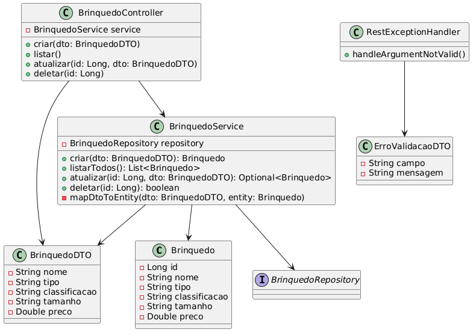

# CP2 Brinquedos API 🧸

API RESTful desenvolvida em **Java com Spring Boot** para gerenciamento de um catálogo de brinquedos. O projeto implementa operações CRUD completas, seguindo arquitetura em camadas e boas práticas de desenvolvimento.

---

## 👨‍💻 Integrantes

- Pedro Henrique Luiz Alves Duarte — RM563405  
- Henrique Martins Oliveira — RM563620  
- Guilherme Macedo Martins — RM562396  

---

## 🛠 Tecnologias Utilizadas

- Java  
- Spring Boot (Web, Data JPA, Validation)  
- Maven  
- Banco de Dados com JPA  

---

## ⚙️ Arquitetura do Projeto

O sistema segue o padrão MVC:

- **Controller** → recebe requisições HTTP  
- **Service** → regra de negócio  
- **Repository** → acesso ao banco  
- **Entity** → tabela no banco  
- **DTO** → validação de dados  
- **Exception Handler** → tratamento de erros  

---

## 🧠 Fluxo da Aplicação
Cliente → Controller → Service → Repository → Banco de Dados


---

## 📊 Diagrama de Classes




---

## 📸 Imagens do Projeto

<a href="https://ibb.co/hxJVpdCT"></a>

---

<a href="https://ibb.co/93YFnXgT"></a>

---

<a href="https://ibb.co/gbKC77D3"></a>

---

<a href="https://ibb.co/R4g8s6BN"></a>
---

<a href="https://ibb.co/cKWRRQMc"></a>

---
<a href="https://ibb.co/5gC61mG3"></a>

---

<a href="https://ibb.co/S7tSJWbG"></a>
---

<a href="https://imgbb.com/"></a>

---

<a href="https://ibb.co/kV04HBqD"></a>

---

<a href="https://ibb.co/q3jvC20c"></a>

---

## 🚀 Como Rodar o Projeto

### ✅ Pré-requisitos

- Java 17+
- Maven

---

### ▶️ Passos

1. Clonar o repositório
git clone <https://github.com/pedrohenrique116/cp2-java.git>


2. Entrar na pasta
cd cp2brinquedos


3. Rodar o projeto
mvn spring-boot:run


---

## 🌐 Acessar API

http://localhost:8080/brinquedos


---

## 📌 Endpoints

| Método | Endpoint | Descrição |
|--------|--------|----------|
| GET | /brinquedos | Listar todos |
| GET | /brinquedos/{id} | Buscar por ID |
| POST | /brinquedos | Criar |
| PUT | /brinquedos/{id} | Atualizar |
| DELETE | /brinquedos/{id} | Deletar |

---

## 📥 Exemplo de JSON

```json
{
  "nome": "Carrinho de Controle Remoto",
  "tipo": "Veículo",
  "classificacao": "Maiores de 8 anos",
  "tamanho": "Médio",
  "preco": 149.90
}